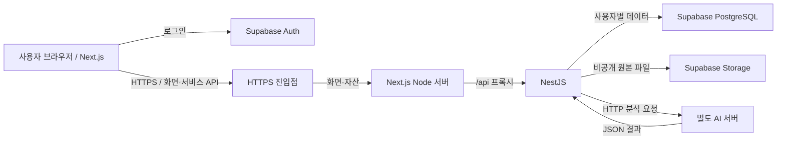
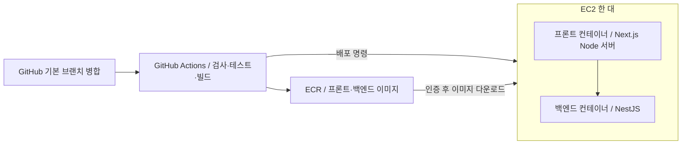

# 채팅 기록 기반 도우미 — 그랬잖아

같은 대화를 서로 다르게 기억하거나 시점에 따라 발언이 달라져 생기는 오해를 대화 기록으로 확인하고, 갈등 해결을 지원하는 웹 서비스입니다. AI의 판단을 확정된 사실로 제시하지 않고 원문 근거와 다양한 관점을 함께 제공합니다.

## 프로젝트와 제작자

건국대학교 졸업프로젝트이며, 팀명은 **그랬잖아**입니다.

| 구분 | 이름 |
| --- | --- |
| 팀원 | 김태은, 문재현, 유지연 |
| 지도교수 | 이향원 |

개인별 개발 역할은 아직 확정하지 않았습니다. 초기 설계는 3-01~3-04 활동서와 3-02·3-04 발표를 바탕으로 정리했습니다. 원본 자료는 저장소 외부에 있으므로 문서 이용에 필수인 외부 파일 링크를 두지 않습니다.

## 주요 기능

아래 기능은 구현 예정입니다.

| 기능 | 제공할 내용 |
| --- | --- |
| 대화 업로드·파싱 | 카카오톡 내보내기 텍스트를 날짜·발화자·본문으로 구조화 |
| 통계 리포트 | 대화량, 시간대 분포, 답장 간격 계산 |
| 모순 탐지 | 발언 불일치 후보와 근거 메시지 표시 |
| 페르소나 의견 | 관점별 의견과 갈등 해결 제안; 생성 응답을 실제 여론 비율로 표현하지 않음 |
| 일정 관리 | AI가 추출한 일정 후보를 사용자가 확인한 후 저장·수정 |

로그인한 사용자는 자신의 대화와 결과만 조회합니다. 초기에는 외부 캘린더 연동을 포함하지 않습니다.

## 시스템 구성



| 구성 | 기술과 책임 |
| --- | --- |
| 프론트엔드 | Next.js App Router, React, TypeScript, Tailwind CSS, shadcn/ui; 화면·입력·상태 표시 |
| 백엔드 | NestJS, TypeScript, Swagger; 인증 검증·파싱·통계·AI 작업 관리·결과 저장 |
| 데이터베이스 | Supabase Auth, PostgreSQL, 비공개 Storage; 사용자와 데이터 보관 |
| AI 서버 | 로컬 모델 실행 서버 또는 GPU 대여 서버; 모델·제공자 미선정 |

React는 인증을 위해 Supabase Auth에 연결하고 서비스 데이터는 NestJS를 통해 접근합니다. AI 서버는 구조화된 결과를 반환하고 NestJS가 검증·저장합니다. AI 서버에 DB 관리 권한을 부여하지 않습니다.

긴 분석은 작업 ID를 반환하고 프론트에서 상태를 조회합니다. 상태는 `pending → processing → completed / failed`이며, 모의 AI로 전체 흐름을 먼저 검증합니다.

## 배포 구성



EC2에서 Docker Compose로 두 컨테이너를 실행합니다. 커밋 SHA 태그로 이미지를 구분하고 단순 교체 배포하며 짧은 중단을 허용합니다. 배포 확인 실패 시 이전 이미지로 복구합니다. Supabase와 AI 서버는 EC2의 두 컨테이너에 포함하지 않습니다.

3-04 발표에서 제시한 SQS, Blue-Green 배포, ASG·Load Balancer는 후속 검토 항목입니다. 초기 AI 연결은 HTTP입니다.

## 현재 상태와 개발 문서

현재는 **M1 개발 기반 구성 완료 단계**입니다. Next.js·NestJS 앱을 pnpm workspace와 Turborepo로 구성했으며 상태 확인 API·Swagger·Docker 개발 환경이 있습니다. Figma 토큰 기반 8개 화면과 합성 데이터 체험을 구현했습니다. 인증·개인 저장·서버 파싱·AI·실제 배포는 미연결입니다.

## 로컬 개발

소스는 `apps/frontend`, `apps/backend`로 나눕니다. 앱의 독립 실행·배포 경계를 유지하면서 루트의 Turborepo가 공통 작업을 실행하는 구조입니다. 아직 공유 코드가 없으므로 빈 공용 패키지는 만들지 않습니다.

### Docker 실행

Docker Desktop의 Linux 컨테이너 엔진이 실행 중이어야 합니다. 저장소 루트에서 실행합니다. 호스트 Node 설치 없이도 실행할 수 있습니다.

```sh
docker compose up --build
```

| 접근 주소 | 용도 |
| --- | --- |
| http://localhost:5173 | Next.js 화면 체험·백엔드 연결 확인 |
| http://localhost:3000/api/health | 백엔드 상태; `{"status":"ok","service":"backend"}` |
| http://localhost:5173/api/docs | 프론트 프록시를 통한 Swagger |
| http://localhost:3000/api/docs | 백엔드 Swagger 직접 접근 |
| http://localhost:3000/api/docs-json | OpenAPI JSON |

소스 변경은 Next.js Fast Refresh·NestJS watch로 반영합니다. Windows 파일 변경 감지를 위해 polling을 사용합니다. 의존성·Dockerfile·백엔드 설정 변경 후에는 `docker compose up --build`로 재빌드합니다. 실행을 종료하려면 다음 명령을 사용합니다.

```sh
docker compose down
```

`.env.example`을 `.env`로 복사하면 호스트 포트를 변경할 수 있습니다. 기본값 사용 시 복사하지 않아도 됩니다. Compose는 개발 전용이며 Next.js Node 운영 이미지와 HTTPS 진입점은 M4에서 구성합니다. DB·AI 서버를 로컬 컨테이너로 실행하지 않습니다.

### 호스트 실행·검증

Node.js 24.x와 pnpm 10.15.0, Turbo 2.9.14를 사용합니다. Windows 터미널 충돌을 피하도록 루트 실행 스크립트에서 로컬 바이너리 재탐색을 끕니다. 저장소 루트에서 실행합니다.

```sh
pnpm install --frozen-lockfile
pnpm dev
```

Docker와 호스트 개발 서버는 동일 포트를 사용하므로 한 방식씩 실행합니다. 호스트 Next.js도 `/api`를 백엔드 3000번 포트로 프록시합니다.

```sh
pnpm typecheck
pnpm lint
pnpm build
pnpm test
```

`pnpm test`는 Turborepo가 백엔드를 빌드한 후 상태 API·Swagger 통합 테스트를 실행합니다. 현재 프론트 자동 테스트 스위트는 없으며 타입 검사·정적 검사·빌드와 개발 서버 연결로 검증합니다.

브랜치는 `codex/m<번호>/<기능>`, 커밋은 한 작업 단위의 `<type>(<scope>): <한국어 요약>`으로 나눕니다. 상세 규칙은 [하네스](.agents/agents.md#브랜치와-커밋-규칙)를 따릅니다. `.agents`와 잠금 파일은 추적하며 의존성·임시 파일·빌드 결과·비밀 설정은 제외합니다.

| 문서 | 용도 |
| --- | --- |
| [하네스와 마일스톤](.agents/agents.md) | 선택적 문서 읽기, 진행 상태, 다음 작업 |
| [프론트엔드](.agents/frontend/guide.md) | UI·상태·스타일·라이브러리 규칙 |
| [백엔드](.agents/backend/guide.md) / [API 초안](.agents/backend/api.md) | 서버 책임·테스트·서비스 계약 |
| [데이터 구조](.agents/database/schema.md) | 개념 스키마·소유권 |
| [AI 연결](.agents/AI/guide.md) / [AI 계약 초안](.agents/AI/api.md) | 분석 경계·모델 후보·HTTP 계약 |
| [인프라](.agents/infra/guide.md) | 개발·배포·권한·복구 |

문서의 설계 초안은 구현 완료를 뜻하지 않습니다. 실제 진행 상태는 중앙 하네스에서 관리합니다.

## 라이선스

[LICENSE](LICENSE)를 참고합니다.

### 화면 체험

/login에서 화면 체험하기를 선택합니다. /conversations, /upload, /conversation/team/messages·statistics·contradiction·opinions·schedules를 제공합니다. 변경은 현재 탭 메모리에만 유지됩니다. 실제 파일은 로컬 미리보기만 지원하고 서버에 전송하지 않습니다. 상세는 [.agents/frontend/screens.md](.agents/frontend/screens.md)를 참조합니다.

프로덕션 로컬 실행은 빌드 후 pnpm --filter @gratta/frontend start이며 포트는 5173입니다. API 프록시 기본 대상은 http://127.0.0.1:3000입니다.
